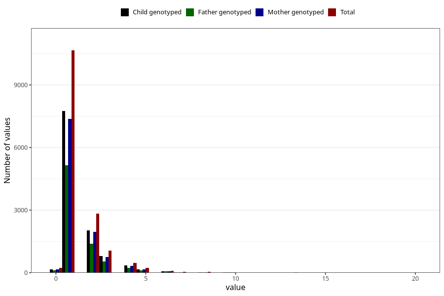

# ear_infection_number_12_18m
Variable mapping to questionnaire: q5, question EE228.
- Number of values:

| Value | Total | Child genotyped | Mother genotyped | Father genotyped |
| ----- | ----- | --------------- | ---------------- | ---------------- |
| Missing | 97897 | 63966 | 60818 | 42567 |
| Non-missing | 15726 | 11465 | 10951 | 7651 |
| Filled in text or mark instead of number | 1 | 0 | 0 |0 |
| 25th percentile | 1 | 1 | 1 | 1 |
| 50th percentile | 1 | 1 | 1 | 1 |
| 75th percentile | 2 | 2 | 2 | 2 |

