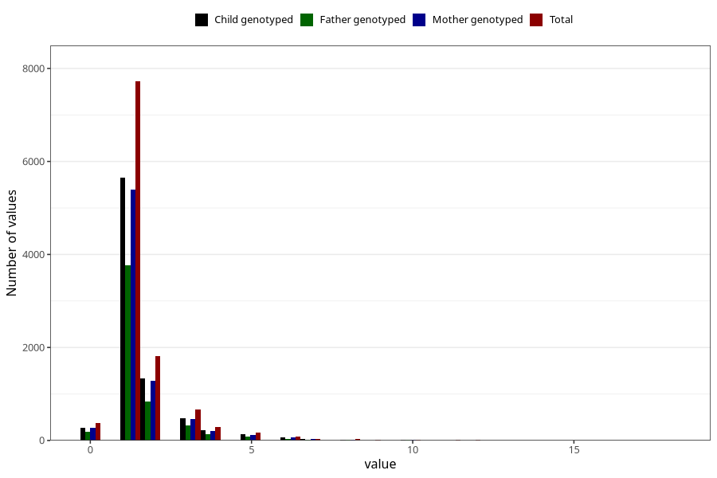

# ear_infection_number_6_11m
Variable mapping to questionnaire: q5, question EE226.
- Number of values:

| Value | Total | Child genotyped | Mother genotyped | Father genotyped |
| ----- | ----- | --------------- | ---------------- | ---------------- |
| Missing | 102398 | 67195 | 63898 | 44806 |
| Non-missing | 11225 | 8236 | 7871 | 5412 |
| Filled in text or mark instead of number | 1 | 0 | 0 |0 |
| 0 | 371 | 274 | 264 | 193 |
| 1 | 7721 | 5659 | 5400 | 3762 |
| 2 | 1811 | 1339 | 1279 | 844 |
| 3 | 662 | 482 | 463 | 316 |
| 4 | 284 | 216 | 210 | 138 |
| 5 | 168 | 129 | 122 | 82 |
| 6 | 86 | 61 | 58 | 34 |
| 7 | 36 | 28 | 27 | 16 |
| 8 | 31 | 17 | 17 | 7 |
| 9 | 11 | 6 | 6 | 4 |
| 10 | 23 | 14 | 14 | 7 |
| 11 | 9 | 6 | 6 | 5 |
| 12 | 7 | 4 | 4 | 3 |
| 14 | 1 | 0 | 0 | 0 |
| 15 | 1 | 1 | 1 | 1 |
| 18 | 2 | 0 | 0 | 0 |

