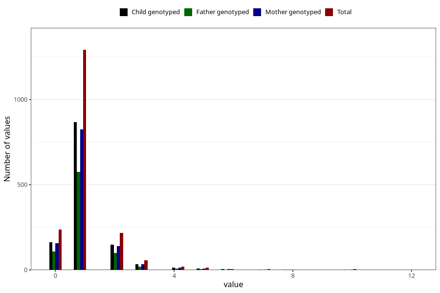

# febrile_convulsions_number_12_18m
Variable mapping to questionnaire: q5, question EE258.
- Number of values:

| Value | Total | Child genotyped | Mother genotyped | Father genotyped |
| ----- | ----- | --------------- | ---------------- | ---------------- |
| Missing | 111771 | 74187 | 70582 | 49396 |
| Non-missing | 1852 | 1244 | 1187 | 822 |
| 0 | 237 | 163 | 156 | 108 |
| 1 | 1291 | 868 | 826 | 575 |
| 2 | 217 | 148 | 140 | 101 |
| 3 | 57 | 33 | 33 | 20 |
| 4 | 20 | 14 | 14 | 9 |
| 5 | 13 | 7 | 7 | 4 |
| 6 | 5 | 4 | 4 | 1 |
| 7 | 4 | 2 | 2 | 0 |
| 8 | 3 | 2 | 2 | 2 |
| 10 | 4 | 2 | 2 | 1 |
| 12 | 1 | 1 | 1 | 1 |

