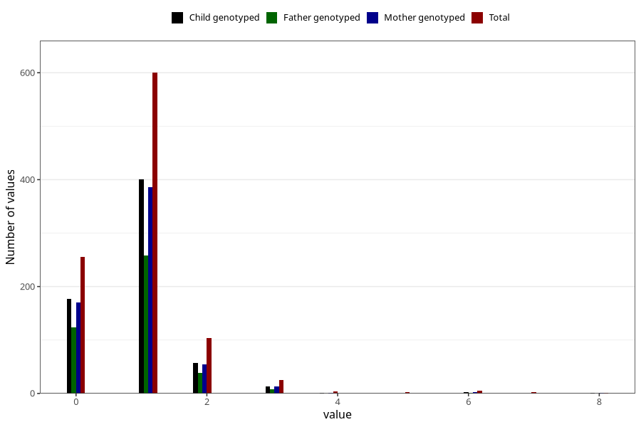

# febrile_convulsions_number_6_11m
Variable mapping to questionnaire: q5, question EE256.
- Number of values:

| Value | Total | Child genotyped | Mother genotyped | Father genotyped |
| ----- | ----- | --------------- | ---------------- | ---------------- |
| Missing | 112622 | 74778 | 71140 | 49789 |
| Non-missing | 1001 | 653 | 629 | 429 |
| 0 | 256 | 177 | 170 | 124 |
| 1 | 600 | 401 | 386 | 258 |
| 2 | 104 | 57 | 55 | 38 |
| 3 | 25 | 13 | 13 | 8 |
| 4 | 4 | 1 | 1 | 0 |
| 5 | 3 | 0 | 0 | 0 |
| 6 | 5 | 3 | 3 | 1 |
| 7 | 3 | 0 | 0 | 0 |
| 8 | 1 | 1 | 1 | 0 |

