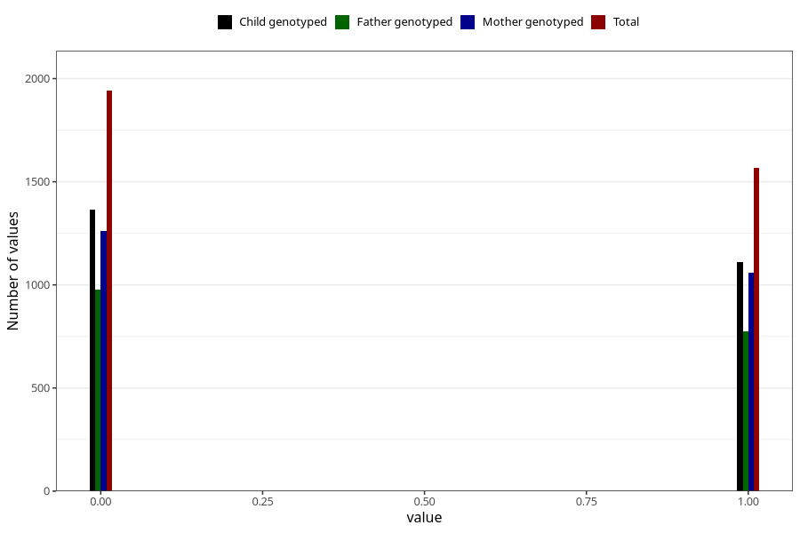

# frequent_stomach_pain_yes_3y
Variable mapping to questionnaire: q6, question GG571.
- Number of values:

| Value | Total | Child genotyped | Mother genotyped | Father genotyped |
| ----- | ----- | --------------- | ---------------- | ---------------- |
| Missing | 110116 | 72956 | 69448 | 48464 |
| Non-missing | 3507 | 2475 | 2321 | 1754 |
| 0 | 1941 | 1364 | 1263 | 979 |
| 1 | 1566 | 1111 | 1058 | 775 |

