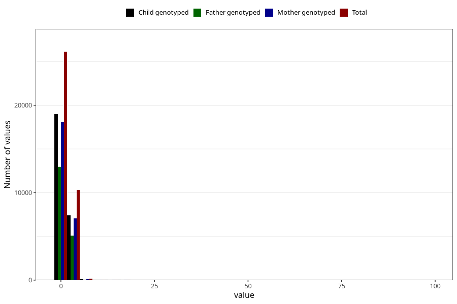

# gastric_flu_diarrhea_number_12_18m
Variable mapping to questionnaire: q5, question EE243.
- Number of values:

| Value | Total | Child genotyped | Mother genotyped | Father genotyped |
| ----- | ----- | --------------- | ---------------- | ---------------- |
| Missing | 76861 | 48816 | 46437 | 32032 |
| Non-missing | 36762 | 26615 | 25332 | 18186 |
| Filled in text or mark instead of number | 6 | 5 | 4 |3 |
| 25th percentile | 1 | 1 | 1 | 1 |
| 50th percentile | 1 | 1 | 1 | 1 |
| 75th percentile | 2 | 2 | 2 | 2 |

