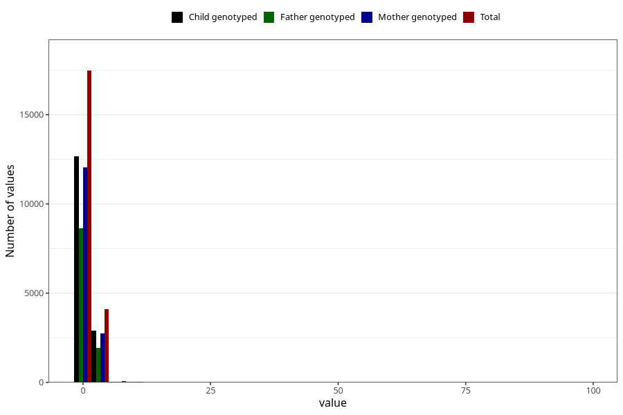

# gastric_flu_diarrhea_number_6_11m
Variable mapping to questionnaire: q5, question EE241.
- Number of values:

| Value | Total | Child genotyped | Mother genotyped | Father genotyped |
| ----- | ----- | --------------- | ---------------- | ---------------- |
| Missing | 91886 | 59747 | 56891 | 39610 |
| Non-missing | 21737 | 15684 | 14878 | 10608 |
| 25th percentile | 1 | 1 | 1 | 1 |
| 50th percentile | 1 | 1 | 1 | 1 |
| 75th percentile | 1 | 1 | 1 | 1 |

