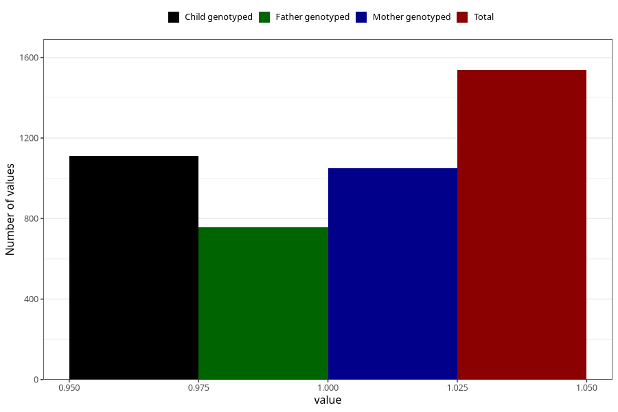

# hip_disorder_dislocated_hip_previously_18m
Variable mapping to questionnaire: q5, question EE789.
- Number of values:

| Value | Total | Child genotyped | Mother genotyped | Father genotyped |
| ----- | ----- | --------------- | ---------------- | ---------------- |
| Missing | 112086 | 74320 | 70718 | 49460 |
| Non-missing | 1537 | 1111 | 1051 | 758 |
| 1 | 1537 | 1111 | 1051 | 758 |

