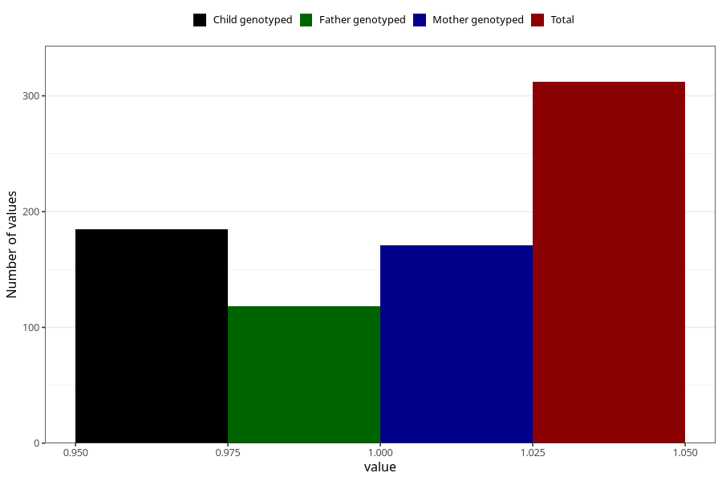

# hyperactivity_past_8y
Variable mapping to questionnaire: q9, question NN46.
- Number of values:

| Value | Total | Child genotyped | Mother genotyped | Father genotyped |
| ----- | ----- | --------------- | ---------------- | ---------------- |
| Missing | 113311 | 75246 | 71598 | 50100 |
| Non-missing | 312 | 185 | 171 | 118 |
| 1 | 312 | 185 | 171 | 118 |

