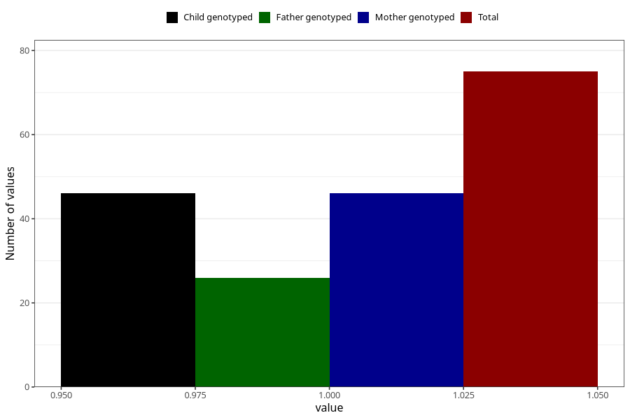

# hyperactivity_previous_3y
Variable mapping to questionnaire: q6, question GG107.
- Number of values:

| Value | Total | Child genotyped | Mother genotyped | Father genotyped |
| ----- | ----- | --------------- | ---------------- | ---------------- |
| Missing | 113548 | 75385 | 71723 | 50192 |
| Non-missing | 75 | 46 | 46 | 26 |
| 1 | 75 | 46 | 46 | 26 |

