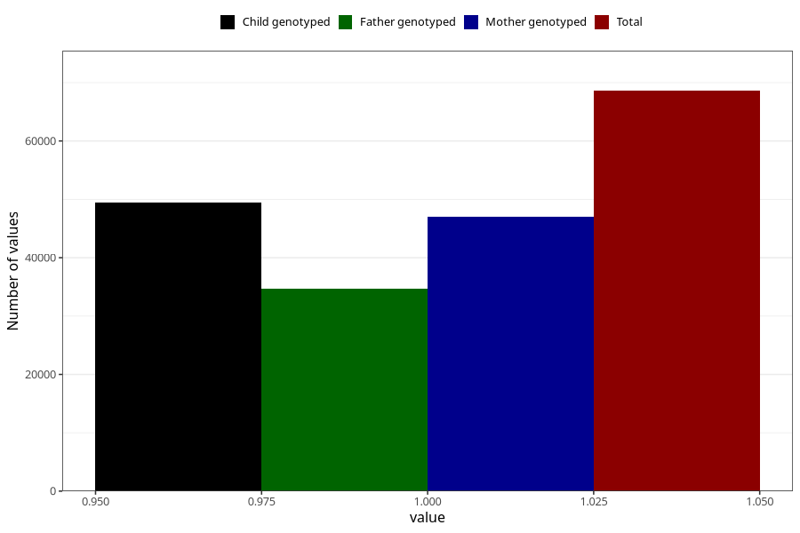

# impaired_hearing_no_18m
Variable mapping to questionnaire: q5, question EE791.
- Number of values:

| Value | Total | Child genotyped | Mother genotyped | Father genotyped |
| ----- | ----- | --------------- | ---------------- | ---------------- |
| Missing | 45019 | 26037 | 24826 | 15557 |
| Non-missing | 68604 | 49394 | 46943 | 34661 |
| 1 | 68604 | 49394 | 46943 | 34661 |

