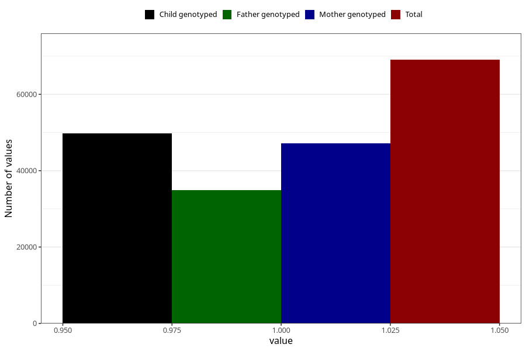

# impaired_vision_no_18m
Variable mapping to questionnaire: q5, question EE795.
- Number of values:

| Value | Total | Child genotyped | Mother genotyped | Father genotyped |
| ----- | ----- | --------------- | ---------------- | ---------------- |
| Missing | 44578 | 25704 | 24529 | 15326 |
| Non-missing | 69045 | 49727 | 47240 | 34892 |
| 1 | 69045 | 49727 | 47240 | 34892 |

