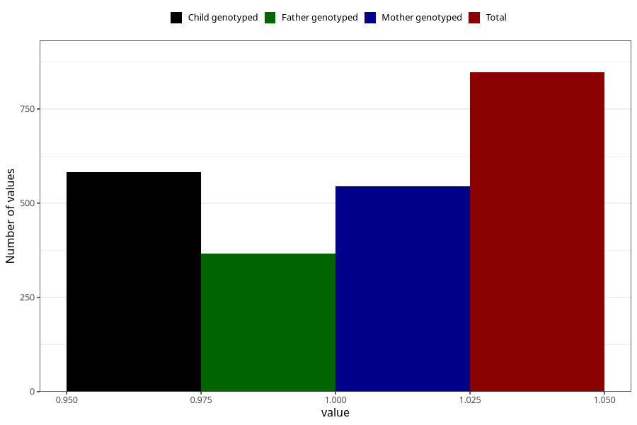

# late_or_abnormal_speech_development_previous_3y
Variable mapping to questionnaire: q6, question GG95.
- Number of values:

| Value | Total | Child genotyped | Mother genotyped | Father genotyped |
| ----- | ----- | --------------- | ---------------- | ---------------- |
| Missing | 112776 | 74849 | 71224 | 49852 |
| Non-missing | 847 | 582 | 545 | 366 |
| 1 | 847 | 582 | 545 | 366 |

