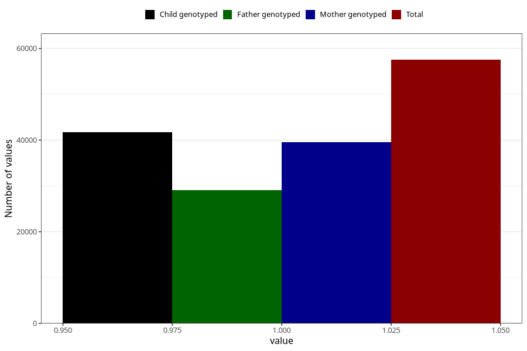

# other_behavioral_problems_no_3y
Variable mapping to questionnaire: q6, question GG109.
- Number of values:

| Value | Total | Child genotyped | Mother genotyped | Father genotyped |
| ----- | ----- | --------------- | ---------------- | ---------------- |
| Missing | 56093 | 33768 | 32172 | 21167 |
| Non-missing | 57530 | 41663 | 39597 | 29051 |
| 1 | 57530 | 41663 | 39597 | 29051 |

