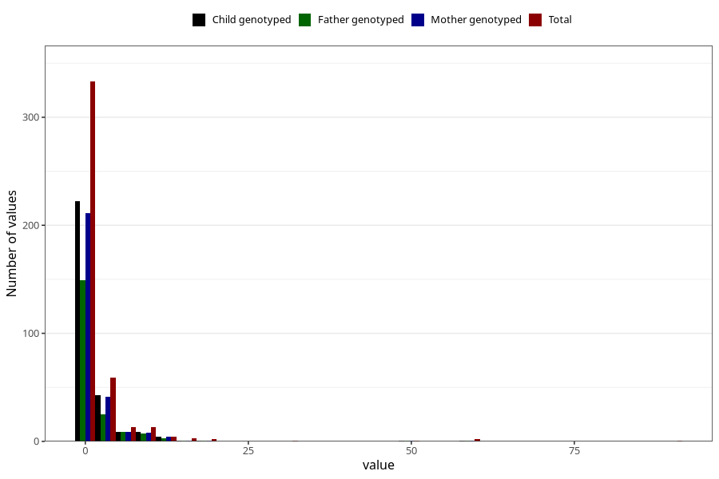

# other_convulsions_no_fever_number_12_18m
Variable mapping to questionnaire: q5, question EE263.
- Number of values:

| Value | Total | Child genotyped | Mother genotyped | Father genotyped |
| ----- | ----- | --------------- | ---------------- | ---------------- |
| Missing | 113187 | 75138 | 71490 | 50020 |
| Non-missing | 436 | 293 | 279 | 198 |
| Filled in text or mark instead of number | 4 | 2 | 2 |1 |
| 25th percentile | 0 | 0 | 0 | 0 |
| 50th percentile | 0 | 0 | 0 | 0 |
| 75th percentile | 1 | 1 | 1 | 1 |

