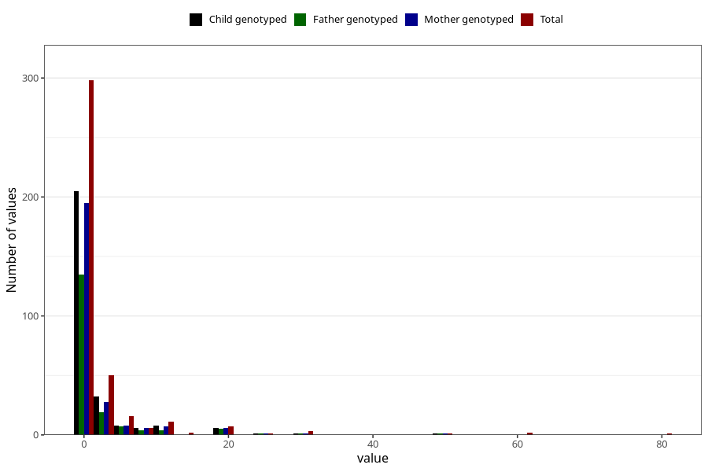

# other_convulsions_no_fever_number_6_11m
Variable mapping to questionnaire: q5, question EE261.
- Number of values:

| Value | Total | Child genotyped | Mother genotyped | Father genotyped |
| ----- | ----- | --------------- | ---------------- | ---------------- |
| Missing | 113221 | 75161 | 71514 | 50040 |
| Non-missing | 402 | 270 | 255 | 178 |
| Filled in text or mark instead of number | 4 | 2 | 2 |1 |
| 25th percentile | 0 | 0 | 0 | 0 |
| 50th percentile | 0 | 0 | 0 | 0 |
| 75th percentile | 1.75 | 1 | 1 | 1 |

