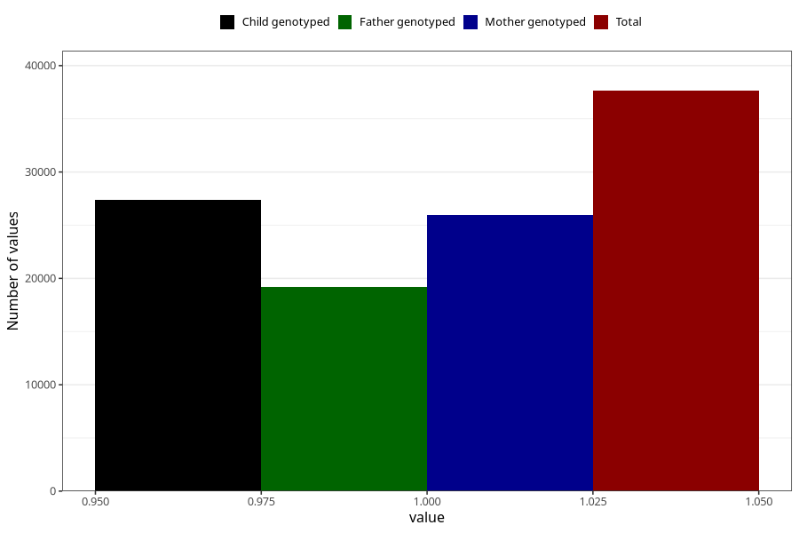

# other_no_18m
Variable mapping to questionnaire: q5, question EE856.
- Number of values:

| Value | Total | Child genotyped | Mother genotyped | Father genotyped |
| ----- | ----- | --------------- | ---------------- | ---------------- |
| Missing | 75989 | 48091 | 45774 | 31040 |
| Non-missing | 37634 | 27340 | 25995 | 19178 |
| 1 | 37634 | 27340 | 25995 | 19178 |

