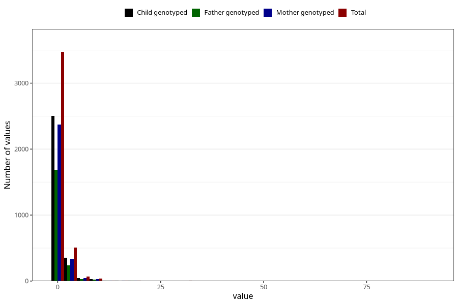

# other_number_12_18m
Variable mapping to questionnaire: q5, question EE273.
- Number of values:

| Value | Total | Child genotyped | Mother genotyped | Father genotyped |
| ----- | ----- | --------------- | ---------------- | ---------------- |
| Missing | 109502 | 72476 | 68964 | 48227 |
| Non-missing | 4121 | 2955 | 2805 | 1991 |
| Filled in text or mark instead of number | 9 | 4 | 4 |4 |
| 25th percentile | 1 | 1 | 1 | 1 |
| 50th percentile | 1 | 1 | 1 | 1 |
| 75th percentile | 1 | 1 | 1 | 1 |

