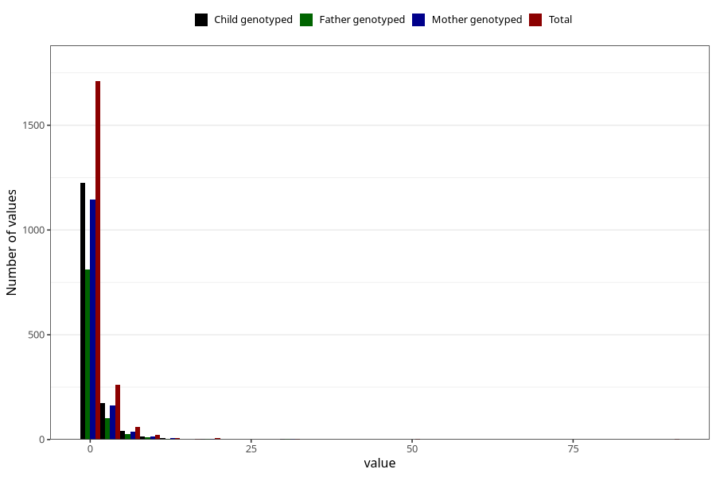

# other_number_6_11m
Variable mapping to questionnaire: q5, question EE271.
- Number of values:

| Value | Total | Child genotyped | Mother genotyped | Father genotyped |
| ----- | ----- | --------------- | ---------------- | ---------------- |
| Missing | 111532 | 73956 | 70387 | 49251 |
| Non-missing | 2091 | 1475 | 1382 | 967 |
| Filled in text or mark instead of number | 8 | 4 | 4 |4 |
| 25th percentile | 1 | 1 | 1 | 1 |
| 50th percentile | 1 | 1 | 1 | 1 |
| 75th percentile | 1 | 1 | 1 | 1 |

