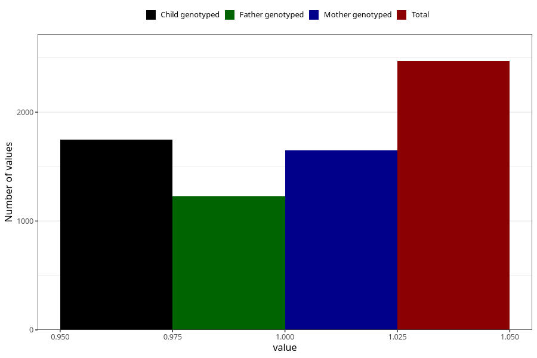

# other_yes_18m
Variable mapping to questionnaire: q5, question EE857.
- Number of values:

| Value | Total | Child genotyped | Mother genotyped | Father genotyped |
| ----- | ----- | --------------- | ---------------- | ---------------- |
| Missing | 111153 | 73684 | 70119 | 48992 |
| Non-missing | 2470 | 1747 | 1650 | 1226 |
| 1 | 2470 | 1747 | 1650 | 1226 |

