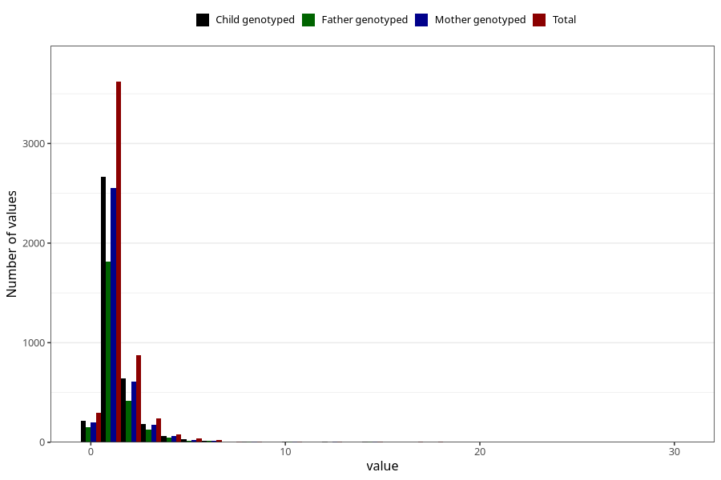

# pseudocroup_number_12_18m
Variable mapping to questionnaire: q5, question EE233.
- Number of values:

| Value | Total | Child genotyped | Mother genotyped | Father genotyped |
| ----- | ----- | --------------- | ---------------- | ---------------- |
| Missing | 108392 | 71598 | 68102 | 47617 |
| Non-missing | 5231 | 3833 | 3667 | 2601 |
| 25th percentile | 1 | 1 | 1 | 1 |
| 50th percentile | 1 | 1 | 1 | 1 |
| 75th percentile | 2 | 1 | 1 | 1 |

