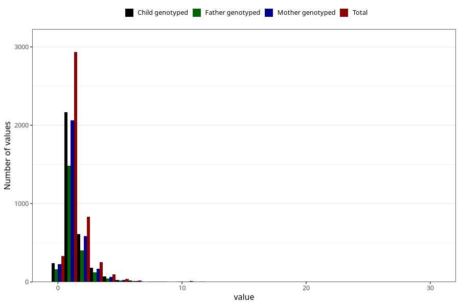

# pseudocroup_number_6_11m
Variable mapping to questionnaire: q5, question EE231.
- Number of values:

| Value | Total | Child genotyped | Mother genotyped | Father genotyped |
| ----- | ----- | --------------- | ---------------- | ---------------- |
| Missing | 109090 | 72098 | 68595 | 47963 |
| Non-missing | 4533 | 3333 | 3174 | 2255 |
| 0 | 331 | 239 | 230 | 161 |
| 1 | 2933 | 2169 | 2061 | 1484 |
| 2 | 830 | 613 | 587 | 402 |
| 3 | 252 | 180 | 171 | 123 |
| 4 | 94 | 71 | 67 | 44 |
| 5 | 41 | 25 | 25 | 19 |
| 6 | 19 | 16 | 14 | 9 |
| 7 | 4 | 3 | 3 | 1 |
| 8 | 7 | 4 | 4 | 4 |
| 9 | 4 | 1 | 1 | 1 |
| 10 | 10 | 6 | 5 | 4 |
| 11 | 3 | 3 | 3 | 2 |
| 20 | 4 | 2 | 2 | 1 |
| 30 | 1 | 1 | 1 | 0 |

