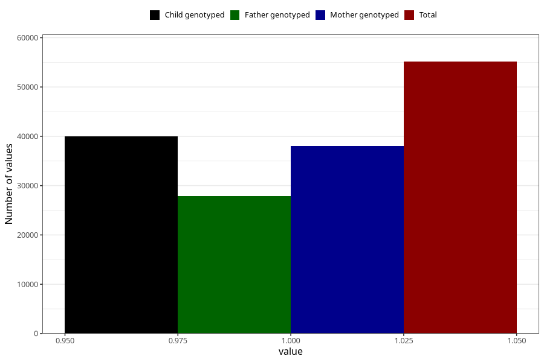

# sleep_problems_no_3y
Variable mapping to questionnaire: q6, question GG97.
- Number of values:

| Value | Total | Child genotyped | Mother genotyped | Father genotyped |
| ----- | ----- | --------------- | ---------------- | ---------------- |
| Missing | 58485 | 35432 | 33761 | 22291 |
| Non-missing | 55138 | 39999 | 38008 | 27927 |
| 1 | 55138 | 39999 | 38008 | 27927 |

