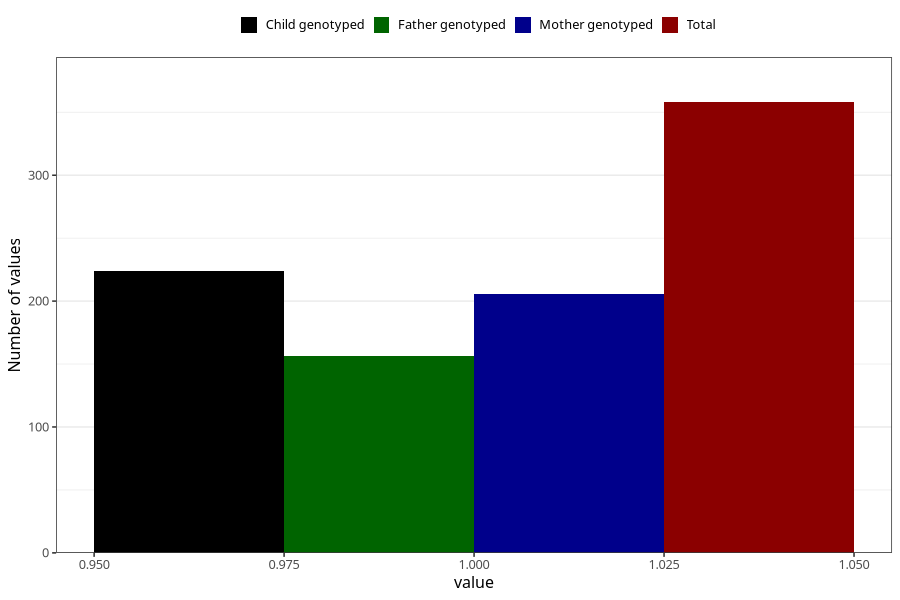

# specialist_diagnosis_3_18m
Variable mapping to questionnaire: q5, question EE864.
- Number of values:

| Value | Total | Child genotyped | Mother genotyped | Father genotyped |
| ----- | ----- | --------------- | ---------------- | ---------------- |
| Missing | 113265 | 75207 | 71563 | 50062 |
| Non-missing | 358 | 224 | 206 | 156 |
| 1 | 358 | 224 | 206 | 156 |

