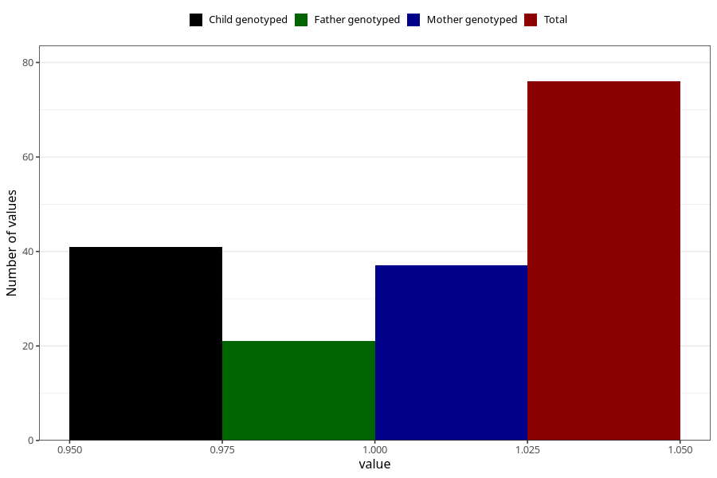

# syndrome_or_chromosomal_defect_name_6m
Variable mapping to questionnaire: q4, question DD1112.
- Number of values:

| Value | Total | Child genotyped | Mother genotyped | Father genotyped |
| ----- | ----- | --------------- | ---------------- | ---------------- |
| Missing | 113547 | 75390 | 71732 | 50197 |
| Non-missing | 76 | 41 | 37 | 21 |
| 1 | 76 | 41 | 37 | 21 |

