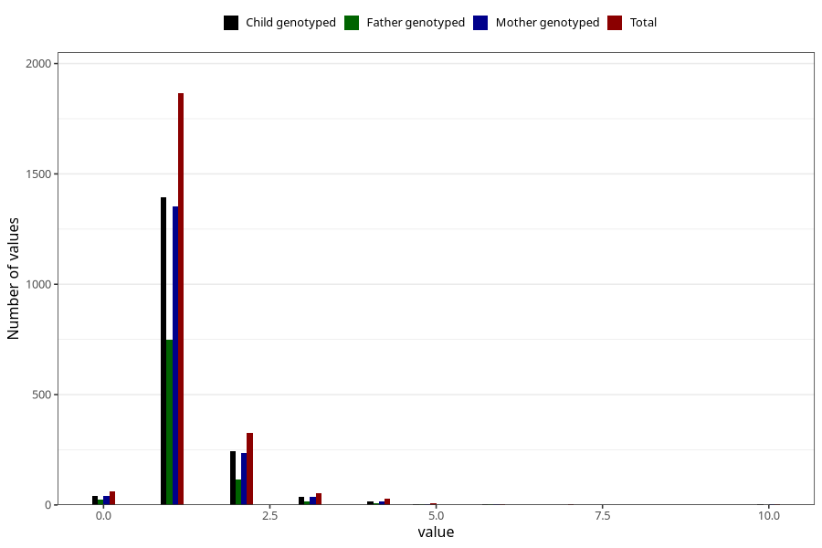

# throat_infection_number_12_18m
Variable mapping to questionnaire: q5, question EE223.
- Number of values:

| Value | Total | Child genotyped | Mother genotyped | Father genotyped |
| ----- | ----- | --------------- | ---------------- | ---------------- |
| Missing | 111273 | 73687 | 70077 | 49301 |
| Non-missing | 2350 | 1744 | 1692 | 917 |
| 0 | 60 | 41 | 40 | 24 |
| 1 | 1865 | 1392 | 1351 | 749 |
| 2 | 326 | 245 | 237 | 116 |
| 3 | 53 | 37 | 35 | 16 |
| 4 | 28 | 17 | 17 | 7 |
| 5 | 9 | 5 | 5 | 2 |
| 6 | 4 | 4 | 4 | 2 |
| 7 | 3 | 1 | 1 | 0 |
| 10 | 2 | 2 | 2 | 1 |

