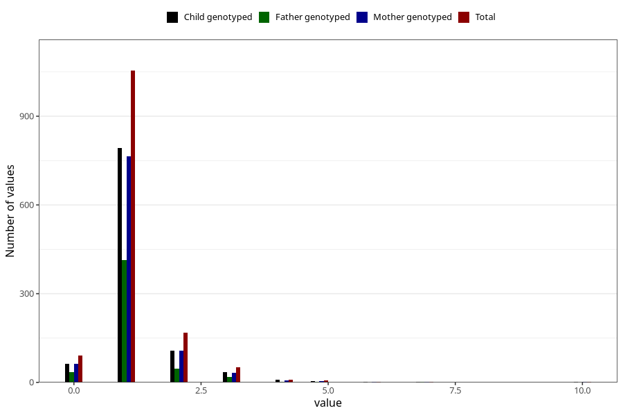

# throat_infection_number_6_11m
Variable mapping to questionnaire: q5, question EE221.
- Number of values:

| Value | Total | Child genotyped | Mother genotyped | Father genotyped |
| ----- | ----- | --------------- | ---------------- | ---------------- |
| Missing | 112236 | 74417 | 70788 | 49699 |
| Non-missing | 1387 | 1014 | 981 | 519 |
| 0 | 90 | 64 | 63 | 35 |
| 1 | 1054 | 792 | 764 | 413 |
| 2 | 169 | 108 | 107 | 46 |
| 3 | 50 | 34 | 32 | 19 |
| 4 | 10 | 8 | 7 | 3 |
| 5 | 7 | 4 | 4 | 2 |
| 6 | 3 | 1 | 1 | 0 |
| 7 | 2 | 2 | 2 | 1 |
| 10 | 2 | 1 | 1 | 0 |

