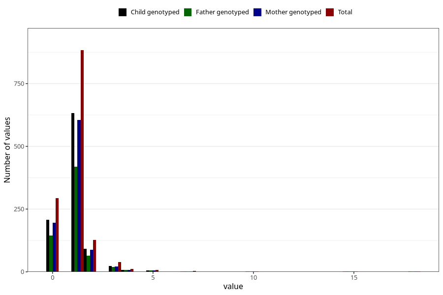

# urinary_tract_infection_number_12_18m
Variable mapping to questionnaire: q5, question EE248.
- Number of values:

| Value | Total | Child genotyped | Mother genotyped | Father genotyped |
| ----- | ----- | --------------- | ---------------- | ---------------- |
| Missing | 112251 | 74458 | 70840 | 49551 |
| Non-missing | 1372 | 973 | 929 | 667 |
| 0 | 293 | 207 | 196 | 144 |
| 1 | 883 | 632 | 605 | 420 |
| 2 | 128 | 91 | 87 | 65 |
| 3 | 38 | 24 | 22 | 20 |
| 4 | 12 | 8 | 8 | 8 |
| 5 | 8 | 6 | 6 | 5 |
| 6 | 1 | 0 | 0 | 0 |
| 7 | 4 | 1 | 1 | 1 |
| 10 | 1 | 1 | 1 | 1 |
| 14 | 1 | 0 | 0 | 0 |
| 15 | 2 | 2 | 2 | 2 |
| 18 | 1 | 1 | 1 | 1 |

