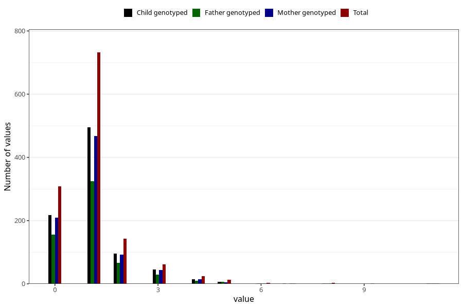

# urinary_tract_infection_number_6_11m
Variable mapping to questionnaire: q5, question EE246.
- Number of values:

| Value | Total | Child genotyped | Mother genotyped | Father genotyped |
| ----- | ----- | --------------- | ---------------- | ---------------- |
| Missing | 112334 | 74550 | 70932 | 49624 |
| Non-missing | 1289 | 881 | 837 | 594 |
| 0 | 308 | 218 | 209 | 155 |
| 1 | 732 | 495 | 468 | 325 |
| 2 | 143 | 96 | 93 | 67 |
| 3 | 61 | 46 | 43 | 29 |
| 4 | 24 | 15 | 14 | 9 |
| 5 | 12 | 6 | 5 | 6 |
| 6 | 3 | 2 | 2 | 1 |
| 7 | 1 | 1 | 1 | 0 |
| 8 | 3 | 1 | 1 | 1 |
| 9 | 1 | 0 | 0 | 0 |
| 11 | 1 | 1 | 1 | 1 |

