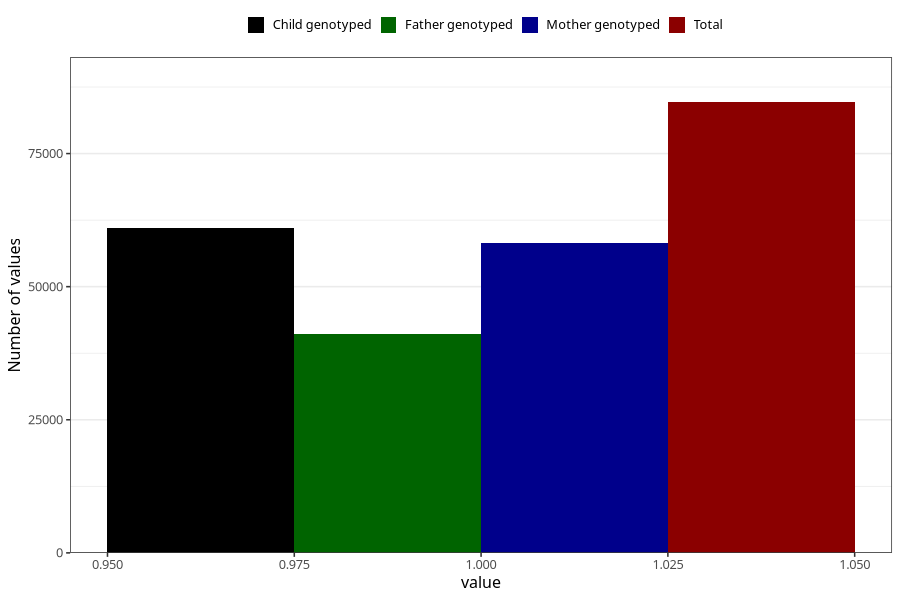

# breastmilk_2m
Variable mapping to questionnaire: q4, question DD51.
- Number of values:

| Value | Total | Child genotyped | Mother genotyped | Father genotyped |
| ----- | ----- | --------------- | ---------------- | ---------------- |
| Missing | 28973 | 14362 | 13625 | 9031 |
| Non-missing | 84650 | 61069 | 58144 | 41187 |
| 1 | 84650 | 61069 | 58144 | 41187 |

