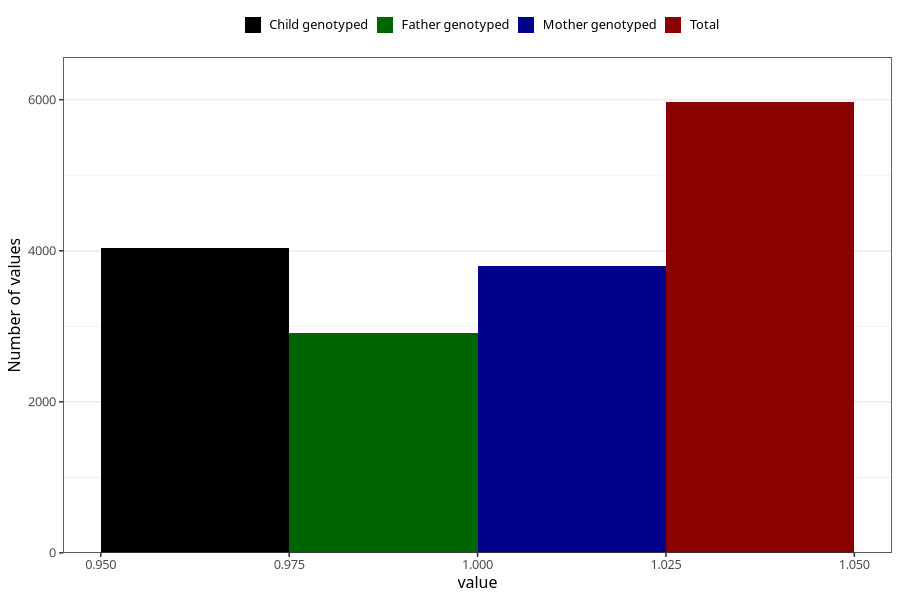

# fluorid_pills_5y
Variable mapping to questionnaire: q7, question LL478.
- Number of values:

| Value | Total | Child genotyped | Mother genotyped | Father genotyped |
| ----- | ----- | --------------- | ---------------- | ---------------- |
| Missing | 107656 | 71395 | 67970 | 47308 |
| Non-missing | 5967 | 4036 | 3799 | 2910 |
| 1 | 5967 | 4036 | 3799 | 2910 |

