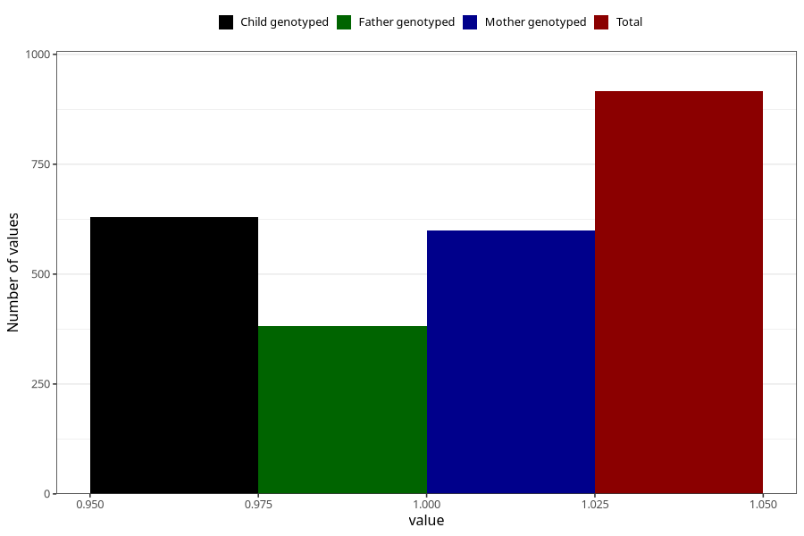

# formula_colett_3m
Variable mapping to questionnaire: q4, question DD59.
- Number of values:

| Value | Total | Child genotyped | Mother genotyped | Father genotyped |
| ----- | ----- | --------------- | ---------------- | ---------------- |
| Missing | 112707 | 74801 | 71169 | 49836 |
| Non-missing | 916 | 630 | 600 | 382 |
| 1 | 916 | 630 | 600 | 382 |

