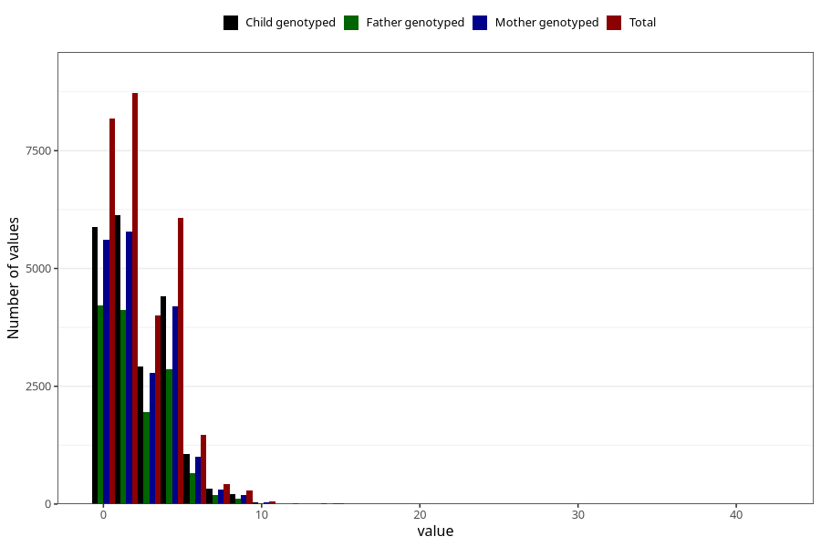

# n_slices_medium_refined_bread_daily_7y
Variable mapping to questionnaire: q8, question JJ340.
- Number of values:

| Value | Total | Child genotyped | Mother genotyped | Father genotyped |
| ----- | ----- | --------------- | ---------------- | ---------------- |
| Missing | 84366 | 54429 | 51819 | 36048 |
| Non-missing | 29257 | 21002 | 19950 | 14170 |
| 25th percentile | 0 | 0 | 0 | 0 |
| 50th percentile | 2 | 2 | 2 | 2 |
| 75th percentile | 4 | 4 | 4 | 4 |

