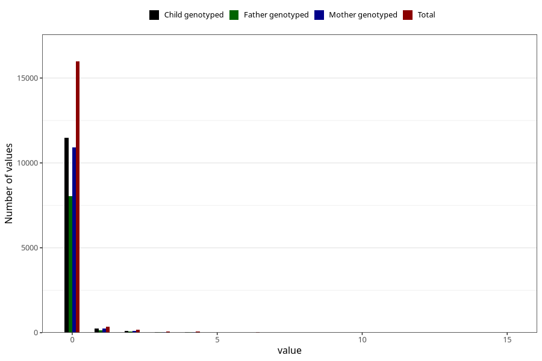

# n_slices_white_bread_daily_7y
Variable mapping to questionnaire: q8, question JJ339.
- Number of values:

| Value | Total | Child genotyped | Mother genotyped | Father genotyped |
| ----- | ----- | --------------- | ---------------- | ---------------- |
| Missing | 96971 | 63491 | 60408 | 41888 |
| Non-missing | 16652 | 11940 | 11361 | 8330 |
| 0 | 15974 | 11489 | 10927 | 8052 |
| 1 | 363 | 252 | 243 | 154 |
| 2 | 178 | 104 | 101 | 65 |
| 3 | 56 | 42 | 39 | 25 |
| 4 | 49 | 32 | 31 | 19 |
| 5 | 10 | 7 | 6 | 6 |
| 6 | 16 | 10 | 10 | 6 |
| 7 | 3 | 2 | 2 | 1 |
| 8 | 1 | 1 | 1 | 1 |
| 10 | 1 | 1 | 1 | 1 |
| 15 | 1 | 0 | 0 | 0 |

