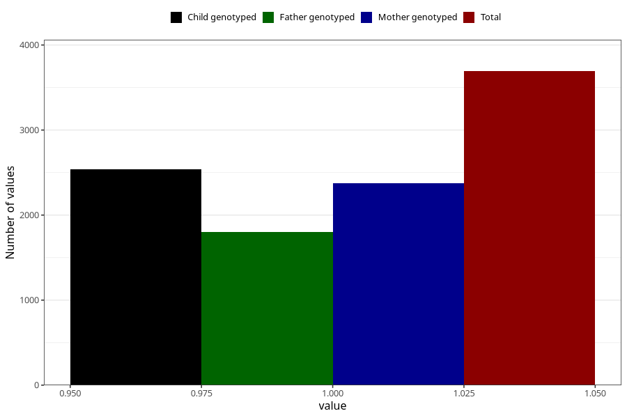

# other_milk_6m
Variable mapping to questionnaire: q4, question DD90.
- Number of values:

| Value | Total | Child genotyped | Mother genotyped | Father genotyped |
| ----- | ----- | --------------- | ---------------- | ---------------- |
| Missing | 109931 | 72891 | 69394 | 48416 |
| Non-missing | 3692 | 2540 | 2375 | 1802 |
| 1 | 3692 | 2540 | 2375 | 1802 |

