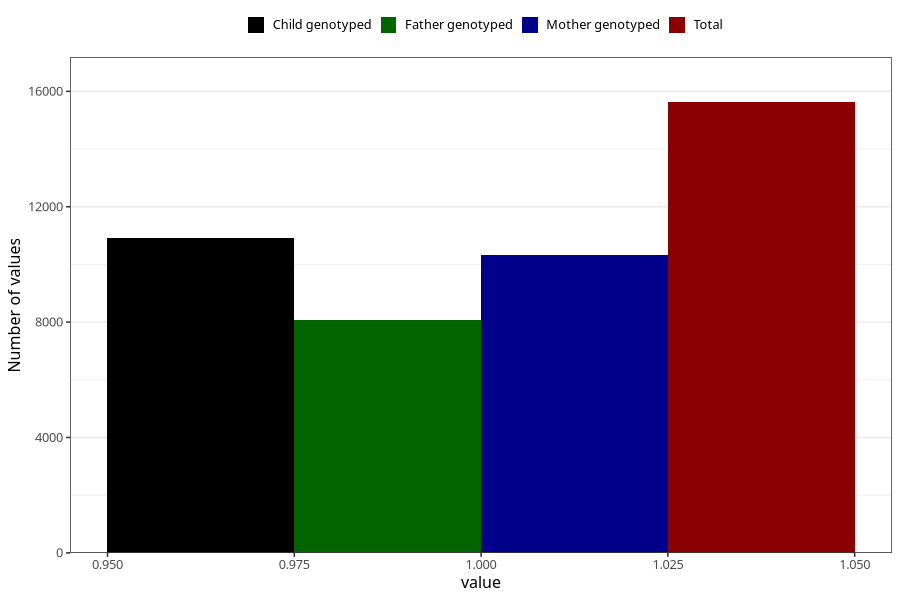

# sanasol_biocit_liquid_5y
Variable mapping to questionnaire: q7, question LL473.
- Number of values:

| Value | Total | Child genotyped | Mother genotyped | Father genotyped |
| ----- | ----- | --------------- | ---------------- | ---------------- |
| Missing | 97999 | 64505 | 61439 | 42152 |
| Non-missing | 15624 | 10926 | 10330 | 8066 |
| 1 | 15624 | 10926 | 10330 | 8066 |

