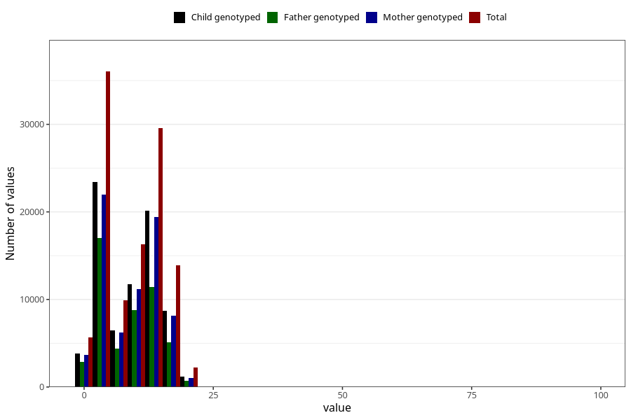

# mother_county_residence_delivery
Variable mapping to questionnaire: mfr, question BOFYLKE.
- Number of values:

| Value | Total | Child genotyped | Mother genotyped | Father genotyped |
| ----- | ----- | --------------- | ---------------- | ---------------- |
| Missing | 0 | 0 | 0 | 0 |
| Non-missing | 113623 | 75431 | 71769 | 50218 |
| 25th percentile | 3 | 3 | 3 | 3 |
| 50th percentile | 10 | 10 | 11 | 9 |
| 75th percentile | 12 | 12 | 12 | 12 |

