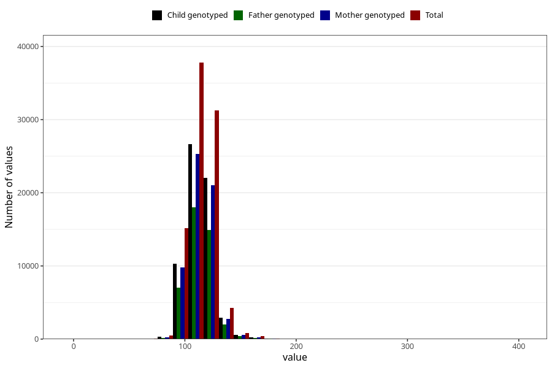

# blood_pressure_15w_systolic
Variable mapping to questionnaire: q1m, question AA83.
- Number of values:

| Value | Total | Child genotyped | Mother genotyped | Father genotyped |
| ----- | ----- | --------------- | ---------------- | ---------------- |
| Missing | 23188 | 12273 | 11634 | 7501 |
| Non-missing | 90435 | 63158 | 60135 | 42717 |
| 25th percentile | 105 | 106 | 106 | 106 |
| 50th percentile | 112 | 112 | 112 | 112 |
| 75th percentile | 120 | 120 | 120 | 120 |

