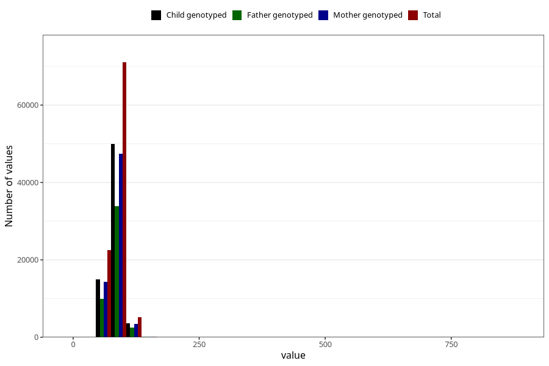

# father_weight_15w
Variable mapping to questionnaire: q1m, question AA89.
- Number of values:

| Value | Total | Child genotyped | Mother genotyped | Father genotyped |
| ----- | ----- | --------------- | ---------------- | ---------------- |
| Missing | 14622 | 6749 | 6405 | 3888 |
| Non-missing | 99001 | 68682 | 65364 | 46330 |
| 25th percentile | 77 | 77 | 77 | 77 |
| 50th percentile | 84 | 85 | 85 | 85 |
| 75th percentile | 92 | 92 | 92 | 92 |

