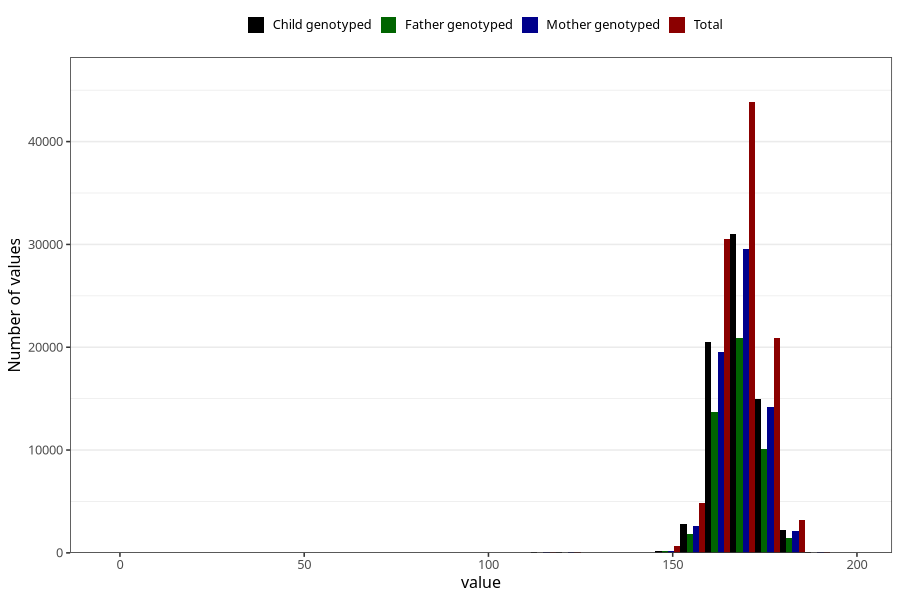

# mother_median_height
- Number of values:

| Value | Total | Child genotyped | Mother genotyped | Father genotyped |
| ----- | ----- | --------------- | ---------------- | ---------------- |
| Missing | 9353 | 3527 | 3342 | 1922 |
| Non-missing | 104270 | 71904 | 68427 | 48296 |
| 25th percentile | 164 | 164 | 164 | 164 |
| 50th percentile | 168 | 168 | 168 | 168 |
| 75th percentile | 172 | 172 | 172 | 172 |

