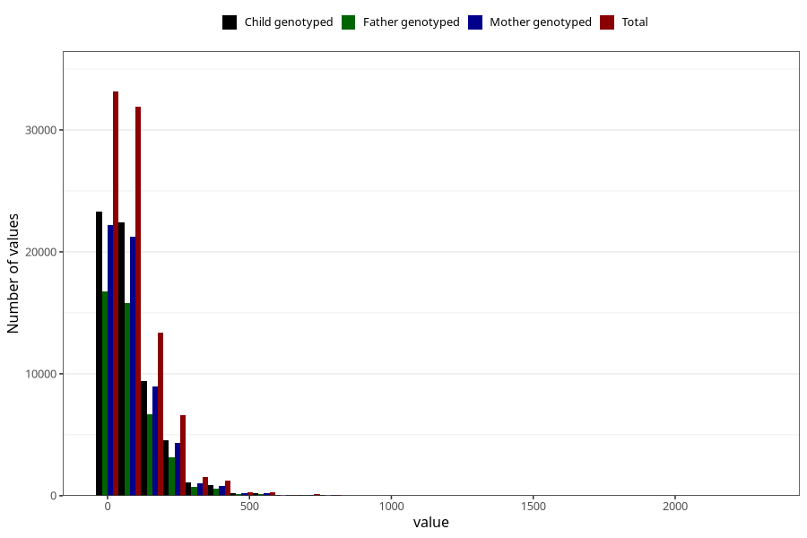

# food_caffeine_total
Variable mapping to questionnaire: q2_caffeine_supplements, question f_caff_tot.
- Number of values:

| Value | Total | Child genotyped | Mother genotyped | Father genotyped |
| ----- | ----- | --------------- | ---------------- | ---------------- |
| Missing | 24927 | 13198 | 12674 | 6238 |
| Non-missing | 88696 | 62233 | 59095 | 43980 |
| 25th percentile | 23.3863 | 23.3787 | 23.38185 | 22.9348 |
| 50th percentile | 59.8283 | 59.6013 | 59.4112 | 58.09485 |
| 75th percentile | 124.53085 | 124.3276 | 124.16445 | 121.698325 |

