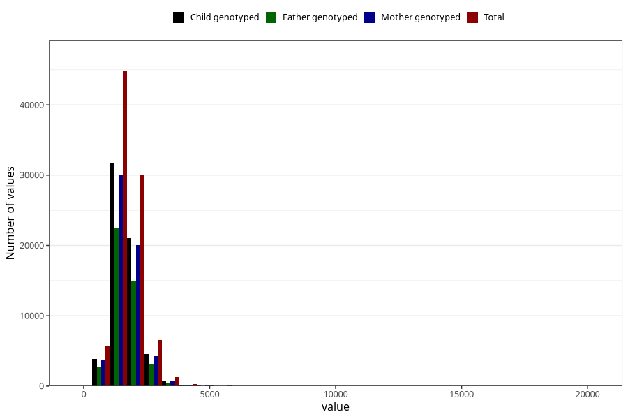

# phosphorus
Variable mapping to questionnaire: q2_cwd_calculations, question FOSFOR.
- Number of values:

| Value | Total | Child genotyped | Mother genotyped | Father genotyped |
| ----- | ----- | --------------- | ---------------- | ---------------- |
| Missing | 24927 | 13198 | 12674 | 6238 |
| Non-missing | 88696 | 62233 | 59095 | 43980 |
| 25th percentile | 1350.6475 | 1352.53 | 1352.205 | 1350.5875 |
| 50th percentile | 1642.745 | 1641.97 | 1641.73 | 1637.675 |
| 75th percentile | 1994.6525 | 1986.84 | 1985.675 | 1978.935 |

