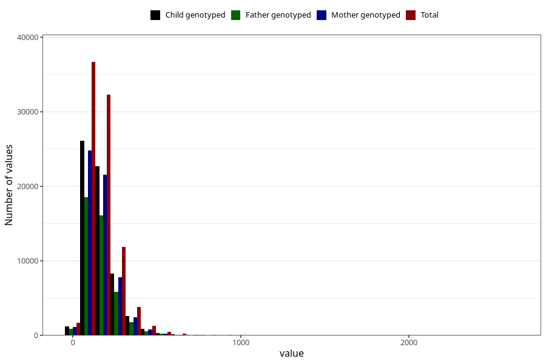

# vitamin_c
Variable mapping to questionnaire: q2_cwd_calculations, question ASKORBIN.
- Number of values:

| Value | Total | Child genotyped | Mother genotyped | Father genotyped |
| ----- | ----- | --------------- | ---------------- | ---------------- |
| Missing | 24927 | 13198 | 12674 | 6238 |
| Non-missing | 88696 | 62233 | 59095 | 43980 |
| 25th percentile | 101.9875 | 101.44 | 101.48 | 101.37 |
| 50th percentile | 147.34 | 146.13 | 146.13 | 145.795 |
| 75th percentile | 207.46 | 205.28 | 205.045 | 204.28 |

