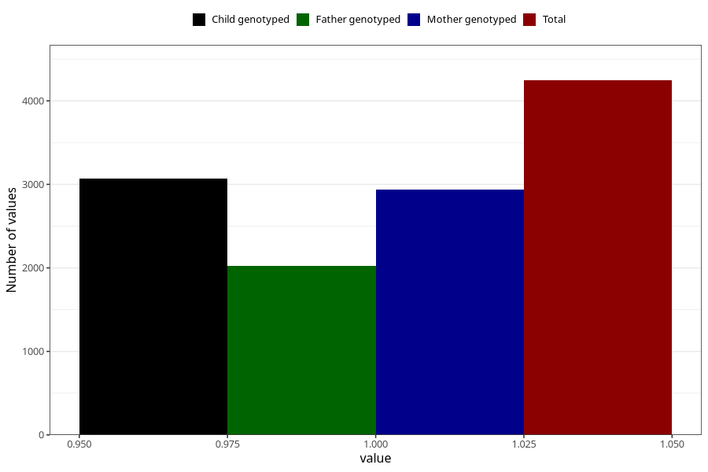

# diarrhoea_25w_28w
Variable mapping to questionnaire: q3, question CC451.
- Number of values:

| Value | Total | Child genotyped | Mother genotyped | Father genotyped |
| ----- | ----- | --------------- | ---------------- | ---------------- |
| Missing | 109378 | 72364 | 68827 | 48195 |
| Non-missing | 4245 | 3067 | 2942 | 2023 |
| 1 | 4245 | 3067 | 2942 | 2023 |

