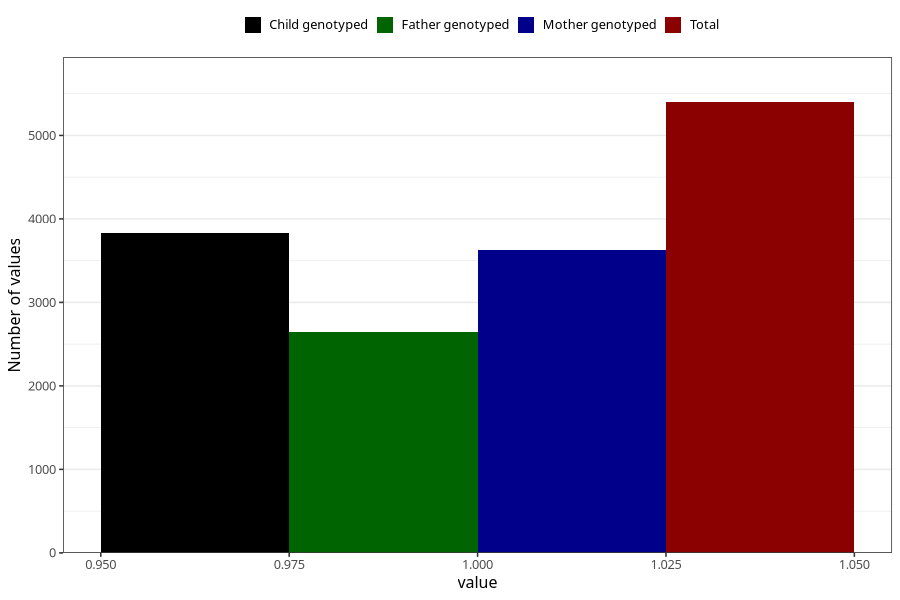

# long_term_nausea_vomiting_17w_20w
Variable mapping to questionnaire: q3, question CC389.
- Number of values:

| Value | Total | Child genotyped | Mother genotyped | Father genotyped |
| ----- | ----- | --------------- | ---------------- | ---------------- |
| Missing | 108225 | 71599 | 68146 | 47575 |
| Non-missing | 5398 | 3832 | 3623 | 2643 |
| 1 | 5398 | 3832 | 3623 | 2643 |

