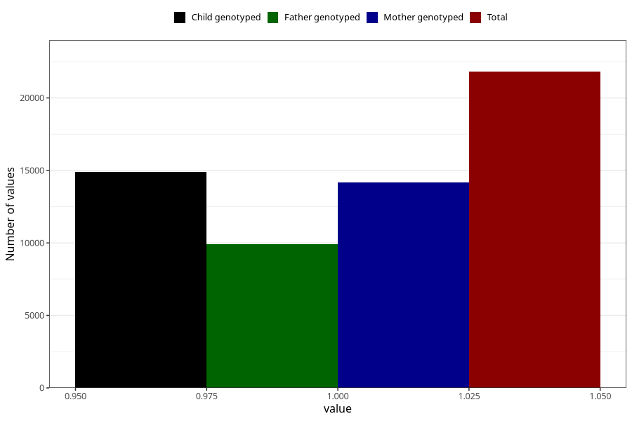

# nausea_before_4w
Variable mapping to questionnaire: q1m, question AA216.
- Number of values:

| Value | Total | Child genotyped | Mother genotyped | Father genotyped |
| ----- | ----- | --------------- | ---------------- | ---------------- |
| Missing | 91815 | 60541 | 57597 | 40299 |
| Non-missing | 21808 | 14890 | 14172 | 9919 |
| 1 | 21808 | 14890 | 14172 | 9919 |

