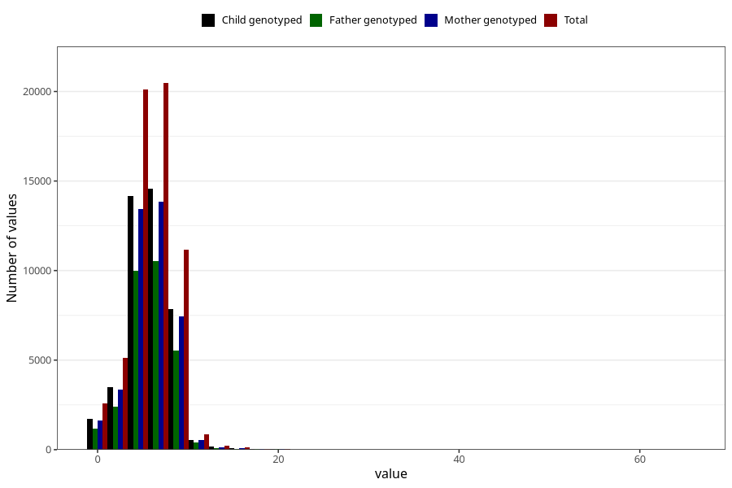

# nausea_week_most_bothered_from_q2
Variable mapping to questionnaire: q2_cwd, question BB853.
- Number of values:

| Value | Total | Child genotyped | Mother genotyped | Father genotyped |
| ----- | ----- | --------------- | ---------------- | ---------------- |
| Missing | 52805 | 32724 | 31243 | 19995 |
| Non-missing | 60818 | 42707 | 40526 | 30223 |
| 25th percentile | 4 | 4 | 4 | 4 |
| 50th percentile | 6 | 6 | 6 | 6 |
| 75th percentile | 7 | 7 | 7 | 7 |

