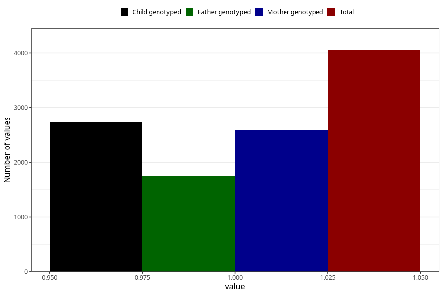

# pregnancy_itch_9w_12w
Variable mapping to questionnaire: q1m, question AA258.
- Number of values:

| Value | Total | Child genotyped | Mother genotyped | Father genotyped |
| ----- | ----- | --------------- | ---------------- | ---------------- |
| Missing | 109576 | 72702 | 69175 | 48457 |
| Non-missing | 4047 | 2729 | 2594 | 1761 |
| 1 | 4047 | 2729 | 2594 | 1761 |

