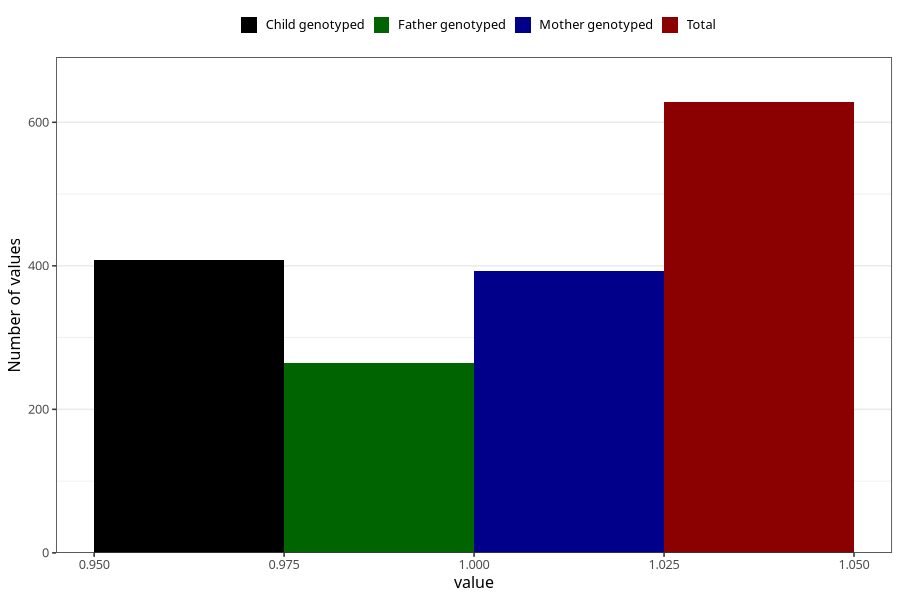

# contraception_used_hormone_injection
Variable mapping to questionnaire: q1m, question AA32.
- Number of values:

| Value | Total | Child genotyped | Mother genotyped | Father genotyped |
| ----- | ----- | --------------- | ---------------- | ---------------- |
| Missing | 112995 | 75023 | 71376 | 49954 |
| Non-missing | 628 | 408 | 393 | 264 |
| 1 | 628 | 408 | 393 | 264 |

