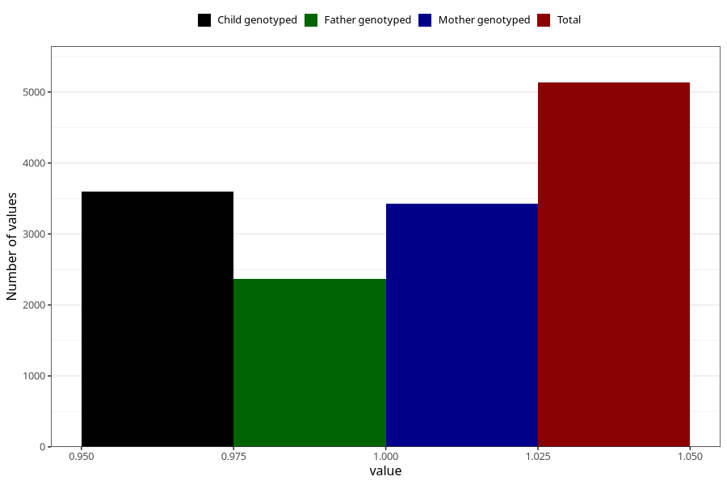

# contraception_used_hormone_iud
Variable mapping to questionnaire: q1m, question AA31.
- Number of values:

| Value | Total | Child genotyped | Mother genotyped | Father genotyped |
| ----- | ----- | --------------- | ---------------- | ---------------- |
| Missing | 108490 | 71837 | 68338 | 47855 |
| Non-missing | 5133 | 3594 | 3431 | 2363 |
| 1 | 5133 | 3594 | 3431 | 2363 |

